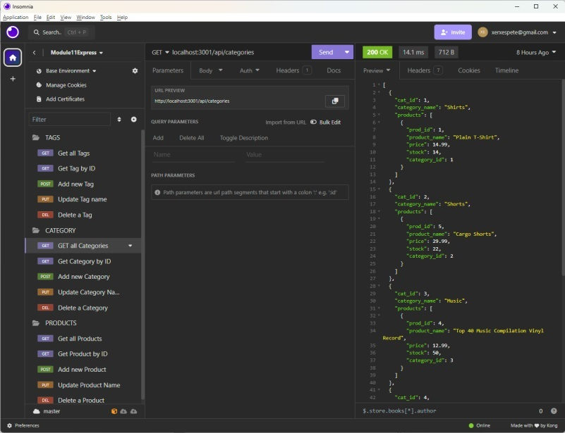

# E-Commerce backend and database
Module 13 Challenge

## Description

The repository holds files to create a database, tables, and seed data that can function as a store inventory with descriptions of items available for search
  1) The developer can query various inventory categories of products and products within those categories.
  2) Products available can be tagged with key words, such as color, that are searchable terms
  3) Developer can see all related tags to a product, and all products related to a category.

## Installation

Contains\

  server.js\

  The /db directory contains a schema to create the database

  Models in the models directory will create tables within the database.

  Seed data is available in the seeds directory

  package.json for adding packages

  A connection file exists in the config directory

Use the schema to manually create database.

Use 

`> node install`

to install packages

`> npm run seed`

will install all seed data

`> node server.js `

will  start the script listening on 3001.

Use Insomnia or Postman to view data 

## Screenshot

## Video of demonstration at https://youtu.be/kFOLS3WCVbI

## Repository at https://github.com/petemaynard/ECommerce_Backend

## Credits

Created by Pete Maynard

